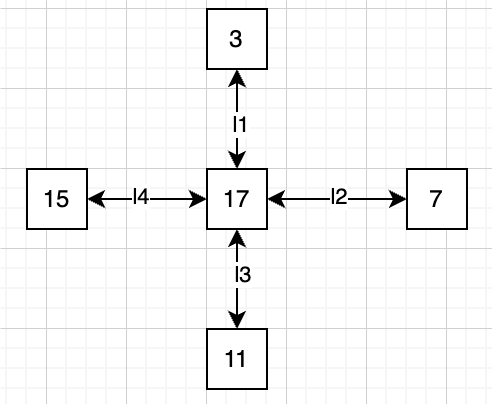

# NuSMV死锁验证
## 规则要求
在一个网络上，有若干个节点，每个节点有对应的编号。节点间的边对应一个通道。节点间的通信是通过发送消息来实现的，并且通道上对应的数字为目的地，即忽略具体发送的消息。现在要判断一个给出的网络是否死锁，已知节点的转发规则有：
- send：节点i发送消息给节点j
- receive：节点i接收消息
- process：根据规则转发消息。

并且假定节每个时间点，这些动作是异步的，即一次只能移动某一步。

## 简单的尝试
例如，对于以下的网络：

M为可以发送和接收信息的点的集合。
可以编写一个模型，首先对于每一个节点，其有三个状态 send, receive, process，对节点的入边和出边进行状态转移.
对于receive，可以视为process的一种特殊情况. 因此此处可以对receive进一步化简。

假设一个节点的入边为 from，出边为 to，则对于from
```smv
next(from) :=
    case
        (from = id) : 0;
        (state = prc & from != 0 & to = 0 & from != id) : 0; --转发信息
        TRUE: from;
    esac;
```
若state = {send, receive}，则from = 0，否则from = id。其他情况无法继续转发，保持原样。
```smv
next(to) :=
    case
        (to = 0 & s = TRUE & state = send) : M; --发送信息
        (state = prc & from != 0 & to = 0 & from != id) : from; --转发信息
        TRUE: to;
    esac;
```
若state = send，则to = M，否则state = prc，则to = from。若都不满足，则表示to非空，或者当前状态为receive，则保持原样。可以发现这样能将receive状态简化，因此只需send和process状态。
```smv
MODULE action(from, to, id, M, s)
    FAIRNESS running
    VAR 
        state: {send, prc};
    ASSIGN
        -- send or process
        init(state) := {send, prc};
        next(state) := {send, prc};
```
随后根据每个节点，定义其是否可以发送消息和接收消息。
```smv
MODULE main
    VAR
        c1: 0..4;
        c2: 0..4;
        c3: 0..4;
        c4: 0..4;
        pc1: process action(c4, c1, 1, {2,3}, TRUE);
        pc2: process action(c1, c2, 2, {1,3}, TRUE);
        pc3: process action(c2, c3, 3, {1,2}, TRUE);
        pc4: process action(c3, c4, 4, {1,2,3}, FALSE);
    ASSIGN
        init(c1) := 0;
        init(c2) := 0;
        init(c3) := 0;
        init(c4) := 0;
        next(c1) := c1;
        next(c2) := c2;
        next(c3) := c3;
        next(c4) := c4;
```
定义CTL公式，判断是否存在死锁。对于每一个节点和通道，最终发生死锁时，每个信道上的值都非空，并且每个节点前后无法转发，也无法接收，可以描述为
$$(c_1 \neq 0\wedge c_2 \neq 0 \wedge c_3 \neq 0 \wedge c_4 \neq 0) \wedge (c_1 \neq 2 \wedge c_2 \neq 3\wedge c_3 \neq 4\wedge c_4 \neq 1) $$
因此判断未来某个时刻不会发生死锁，则CTL公式为
$$ AG (\neg ((c_1 \neq 0\wedge c_2 \neq 0 \wedge c_3 \neq 0 \wedge c_4 \neq 0) \wedge (c_1 \neq 2 \wedge c_2 \neq 3\wedge c_3 \neq 4\wedge c_4 \neq 1)))$$
```smv
CTLSPEC
    AG (! ((c1 != 0 & c2 != 0 & c3 != 0 & c4 != 0) & (c1 != 2 & c2 != 3 & c3 != 4 & c4 != 1)))
```
执行`../NuSMV-2.6.0-Linux/bin/NuSMV simple.smv`，可以得到
```
-- specification AG !((((c1 != 0 & c2 != 0) & c3 != 0) & c4 != 0) & (((c1 != 2 & c2 != 3) & c3 != 4) & c4 != 1))  is false
-- as demonstrated by the following execution sequence
Trace Description: CTL Counterexample 
Trace Type: Counterexample 
  -> State: 1.1 <-
    c1 = 0
    c2 = 0
    c3 = 0
    c4 = 0
    pc1.state = send
    pc2.state = send
    pc3.state = send
    pc4.state = send
  -> Input: 1.2 <-
    _process_selector_ = pc1
    running = FALSE
    pc4.running = FALSE
    pc3.running = FALSE
    pc2.running = FALSE
    pc1.running = TRUE
  -> State: 1.2 <-
    c1 = 3
  -> Input: 1.3 <-
    _process_selector_ = pc2
    pc2.running = TRUE
    pc1.running = FALSE
  -> State: 1.3 <-
    c2 = 1
  -> Input: 1.4 <-
    _process_selector_ = pc3
    pc3.running = TRUE
    pc2.running = FALSE
  -> State: 1.4 <-
    c3 = 2
  -> Input: 1.5 <-
    _process_selector_ = pc4
    pc4.running = TRUE
    pc3.running = FALSE
  -> State: 1.5 <-
    pc4.state = prc
  -> Input: 1.6 <-
  -> State: 1.6 <-
    c3 = 0
    c4 = 2
    pc4.state = send
  -> Input: 1.7 <-
    _process_selector_ = pc3
    pc4.running = FALSE
    pc3.running = TRUE
  -> State: 1.7 <-
    c3 = 1
```
其中给出了一种会发生死锁的过程：
```
send(1,3): c1 = 3
send(2,1): c2 = 1
send(3,2): c3 = 2
process 4: c3 = 0, c4 = 2
send(3,1): c3 = 1
```
可以看到，c1 = 3, c2 = 1, c3 = 1, c4 = 2，此时每个节点都无法继续转发，因此发生了死锁。

## 复杂的网络
对于以下复杂的网络，断言：
- $ M = \{1,5,9,13\}$时不会死锁。
- $ M = \{2,4,6\}$时会死锁。
若继续使用上述方法，对所有节点进行建模，则通道数多达23个，变量空间非常之大，计算开销也会非常大。经测试10分钟也无法解决。

因此，需要考虑缩减状态空间。由于消息发送和接收时，都是走最短路径，因此某些通道必不会经过。

### $ M = \{1,5,9,13\}$
对于这种情况时，通道 $c_{4,6}, c_{8,10}, c_{12,14}, c_{16,2}$将不会经过，可以删除。

去除这个通道后，进一步观察可发现，对于节点2, 4, 6, 8, 10, 12, 14, 16都是转发节点，是否发生死锁与其无关。因此这些节点可以进一步去除。随后得到节点1, 3, 5, 7, 9, 11, 13, 15, 17.

这些节点可以大致分为三类：
- 1, 5, 9, 13为发送和接收节点
- 3, 7, 11, 15为T型转发节点
- 17为中心的转发节点

对于1, 5, 9, 13，实现方法可以与前面的简单方法类似。对于T型转发节点则需要额外考虑：
#### T型转发节点
可以定义每条边通道的名字，随后根据情况考虑。

对于from，其可以去往2个方向，即to和bidirect. 当对应的方向为空时，from置为空表示转发。

对于to，其可以来自两个节点，取决于B的process状态。

对于bidirect，其下一步可以是来自from（如果为空），也可以将消息转发到to（如果不为空）。

可以发现状态定义只于to和bidrect相关，因此定义两个状态{prcfrom, prcto}，prcfrom表示流的方向为 from->to或者from -> bidirect，prcto表示流的方向为bidirect -> to。
```smv
MODULE ac1_1_T(from, to, bidirect, t1, t2, t3)
    FAIRNESS running
    VAR
        -- prcfrom: from -> to, from -> bidirect
        -- prcto: bidirect -> to
        state: {prcfrom, prcto};
    ASSIGN
        init(state) := {prcfrom, prcto};
        next(state) := {prcfrom, prcto};
        -- from
        next(from) :=
            case
                (state = prcfrom & from != 0 & to = 0 & from = t1) : 0;
                (state = prcfrom & from != 0 & bidirect = 0 & (from = t2 | from = t3)) : 0;
                TRUE: from;
            esac;
        -- to
        next(to) :=
            case
                (state = prcfrom & from != 0 & to = 0 & from = t1) : from;
                (state = prcto & bidirect != 0 & to = 0 & bidirect = t1) : bidirect;
                TRUE: to;
            esac;
        -- bidirect
        next(bidirect) :=
            case
                -- bidirect -> to
                (state = prcfrom & bidirect != 0 & to = 0 & bidirect = t1) : from;
                -- from -> bidirect
                (state = prcto & from != 0 & to = 0 & (from = t2|from = t3)) : from;
                TRUE: bidirect;
            esac;
```
#### 中心转发节点
对于中心转发节点，其可以接收来自任意方向的消息，并且转发到任意方向。因此可以定义一个状态，表示当前的方向。

可以定义中心节点L的对应信道的标签为l1, l2, l3, l4


对于l1, 其可能走的节点有9和13，因此l1->l2为9，l1->l3为13. 同理对于l2, 其可能走的节点为13和1，因此l2->l3为13，l2->l4为1. 其余以此类推，总共有8种可能性，定义这8个状态后根据规则转发即可。
```smv
MODULE ac_c(l1, l2, l3, l4)
    FAIRNESS running
    VAR
        --1: l1 -> l2
        --2: l1 -> l3
        --3: l2 -> l3
        --4: l2 -> l4
        --5: l3 -> l4
        --6: l3 -> l1
        --7: l4 -> l1
        --8: l4 -> l2
        state: {p1, p2, p3, p4, p5, p6, p7, p8};
    ASSIGN
        init(state) := {p1, p2, p3, p4, p5, p6, p7, p8};
        next(state) := {p1, p2, p3, p4, p5, p6, p7, p8};

        -- l1
        next(l1) :=
            case
                -- l1 -> l2
                (state = p1 & l1 != 0 & l2 = 0 & l1 = 9): 0;
                -- l1 -> l3
                (state = p2 & l1 != 0 & l3 = 0 & l1 = 13): 0;
                -- l3 -> l1
                (state = p6 & l3 != 0 & l1 = 0 & l3 = 5): l3;
                -- l4 -> l1
                (state = p7 & l4 != 0 & l1 = 0 & l4 = 5): l4;
                TRUE: l1;
            esac;
        -- l2
        next(l2) :=
            case
                -- l2 -> l3
                (state = p3 & l2 != 0 & l3 = 0 & l2 = 13): 0;
                -- l2 -> l4
                (state = p4 & l2 != 0 & l4 = 0 & l2 = 1): 0;
                -- l4 -> l2
                (state = p8 & l4 != 0 & l2 = 0 & l4 = 9): l4;
                -- l1 -> l2
                (state = p1 & l1 != 0 & l2 = 0 & l1 = 9): l1;
                TRUE: l2;
            esac;
        -- l3
        next(l3) :=
            case
                -- l3 -> l4
                (state = p5 & l3 != 0 & l4 = 0 & l3 = 1): 0;
                -- l3 -> l1
                (state = p6 & l3 != 0 & l1 = 0 & l3 = 5): 0;
                -- l1 -> l3
                (state = p2 & l1 != 0 & l3 = 0 & l1 = 13): l1;
                -- l2 -> l3
                (state = p3 & l2 != 0 & l3 = 0 & l2 = 13): l2;
                TRUE: l3;
            esac;
        -- l4
        next(l4) :=
            case
                -- l4 -> l1
                (state = p7 & l4 != 0 & l1 = 0 & l4 = 5): 0;
                -- l4 -> l2
                (state = p8 & l4 != 0 & l2 = 0 & l4 = 9): 0;
                -- l2 -> l4
                (state = p4 & l2 != 0 & l4 = 0 & l2 = 1): l2;
                -- l3 -> l4
                (state = p5 & l3 != 0 & l4 = 0 & l3 = 1): l3;
                TRUE: l4;
            esac;
```
#### 定义CTL公式
对于这种情况，若要发生死锁，可以根据节点分类讨论：
- 对于一般的发送接收节点，死锁时不能转发也不能接收。
- 对于T型转发节点，则对于任意一种转发状态都不能成立，即至少一种转发状态不成立。
- 对于中心转发节点，其任意一种转发状态也不能成立。

因此死锁时，对于一般的发送接收节点，如1号节点（注意删去了一些节点），应有
$$c_{15,1} \neq 1 \wedge c_{1,3} \neq 0$$
对于T型转发节点，如3号节点，应有
$$(c_{1,3} = 5 \wedge c_{3,5} \neq 0) (不能从1转发到5)
\\
\vee ((c_{1,3} = 9 \vee c_{1,3} = 13) \wedge c_{3,17} \neq 0)(不能从1转发到17)
\\
\vee (c_{3,17} = 5 \wedge c_{3,5} \neq 0)(不能从17转发到5)$$
对于中心转发节点，17号节点，类似地应有（即前面所述的状态）
```smv
(((c3_17 = 9 | c15_17 = 9) & c7_17 != 0) &
((c3_17 = 13 | c7_17 = 13) & c11_17 != 0) &
((c7_17 = 1 | c11_17 = 1) & c15_17 != 0) &
((c11_17 = 5 | c15_17 = 5) & c3_17 != 0))
```
最后用$\wedge$连接，同上使用$AG(\neg ...)$判断是否发生死锁，运行后得到（中间表达式省略）：
```
-- specification AG !(...)  is true
```
因此验证了死锁不会发生。
### $M=\{2,4,6\}$
对于这种情况，可以类似地进行建模. 首先考虑不会到达的节点：8,9,10,11,12,13,14都不会经过，并且1与5在最小路径的选择中也不会经过。因此可以删除这些节点。最后得到有效的节点为 2,4,6,7,17,15,16。

其中2,4,6同上为一般的转发节点，7,15,16可视为一般转发节点，3是T型转发节点，17是中心转发节点。对于2,4,6,7,15,16，可以使用上述同样的一般转发节点进行建模，3可用上述T型转发节点建模。对于17，注意到只有2,4,6可以接收，因此实际上只有两种转发方式： $c_{7,17} -> c_{3,17} (发送到4,6)$和 $c_{7,17} -> c_{15,17}(发送到2)$. 因此根据这两种情况进行建模即可。
```smv
MODULE ac1_1_T(from, to, bidirect, t1, t2, t3)
    FAIRNESS running
    VAR
        -- prcfrom: from -> to, from -> bidirect
        -- prcto: bidirect -> to
        state: {prcfrom, prcto};
    ASSIGN
        init(state) := {prcfrom, prcto};
        next(state) := {prcfrom, prcto};
        -- from
        next(from) :=
            case
                -- from -> to
                (state = prcfrom & from != 0 & to = 0 & (from = t2 | from = t3)) : 0;
                -- from -> bidirect
                (state = prcfrom & from != 0 & bidirect = 0 & (from = t1)) : 0;
                TRUE: from;
            esac;
        -- to
        next(to) :=
            case
                -- from -> to
                (state = prcfrom & from != 0 & to = 0 & (from = t2 | from = t3)) : from;
                -- bidirect -> to
                (state = prcto & bidirect != 0 & to = 0 & (bidirect = t2 | bidirect = t3)) : bidirect;
                TRUE: to;
            esac;
        -- bidirect
        next(bidirect) :=
            case
                -- bidirect -> to
                (state = prcto & bidirect != 0 & to = 0 & (bidirect = t2 | bidirect = t3)) : 0;
                -- from -> bidirect
                (state = prcfrom & from != 0 & to = 0 & (from = t1)) : from;
                TRUE: bidirect;
            esac;

MODULE ac_c(l1, l2, l3)
    FAIRNESS running
    VAR
        --1: l2 --> l1(4, 6)
        --2: l2 --> l3(2)
        state: {p1, p2};
    ASSIGN
        init(state) := {p1, p2};
        next(state) := {p1, p2};
        -- l1
        next(l1) :=
            case
                -- l2 -> l1
                (state = p1 & l1 = 0 & (l2 = 4 | l2 = 6)) : l2;
                TRUE: l1;
            esac;
        -- l2
        next(l2) :=
            case
                -- l2 -> l1
                (state = p1 & l1 = 0 & (l2 = 4 | l2 = 6)) : 0;
                -- l2 -> l3
                (state = p2 & l3 = 0 & l2 = 2) : 0;
                TRUE: l2;
            esac;
        -- l3
        next(l3) :=
            case
                -- l2 -> l3
                (state = p2 & l3 = 0 & l2 = 2) : l2;
                TRUE: l3;
            esac;
```
随后定义CTL公式，判断是否发生死锁。对于2,4,6这些可接收的节点，死锁时不能转发也不能接收。对于3这种T型转发节点，死锁时的情况如前。对于一般的转发节点，由于其不会接收，因此其两侧的通道要么全部有消息，要么全部没有消息。对于中心转发节点，定义的情况与前类似。可以得到
```smv
CTLSPEC
        AG (!(
            -- 2
            (c16_2 != 2 & c2_3 != 0)&
            -- 3
            ((c2_3 = 2 & c3_17 != 0) | ((c2_3 = 4 | c2_3 = 6) & c3_4 != 0) | ((c3_17 = 4 | c3_17 = 6) & c3_4 != 0)) &
            -- 4
            (c3_4 != 4 & c4_6 != 0)&
            -- 6
            (c4_6 != 6 & c6_7 != 0)&
            -- 7
            ((c6_7 != 0 & c7_17 != 0) | (c6_7 = 0 & c7_17 = 0)) &
            -- 15
            ((c15_17 != 0 & c15_16 != 0) | (c15_17 = 0 & c15_16 = 0)) &
            -- 16
            ((c15_16 != 0 & c16_2 != 0) | (c15_16 = 0 & c16_2 = 0)) &
            -- 17
            ((c3_17 = 2 & c15_17 != 0) | (c7_17 = 2 & c15_17 != 0) | ((c7_17 = 4 | c7_17 = 6) & c3_17 != 0))
        ))
```
运行后得到
```
-- specification AG !(...)  is false
-- as demonstrated by the following execution sequence
Trace Description: CTL Counterexample 
Trace Type: Counterexample 
  -> State: 1.1 <-
    c2_3 = 0
    c3_4 = 0
    c4_6 = 0
    c6_7 = 0
    c15_16 = 0
    c16_2 = 0
    c3_17 = 0
    c7_17 = 0
    c15_17 = 0
    pr2.state = send
    pr3.state = prcfrom
    pr4.state = send
    pr6.state = send
    pr7.state = send
    pr15.state = send
    pr16.state = send
    pr17.state = p1
  -> Input: 1.2 <-
    _process_selector_ = pr2
    running = FALSE
    pr17.running = FALSE
    pr16.running = FALSE
    pr15.running = FALSE
    pr7.running = FALSE
    pr6.running = FALSE
    pr4.running = FALSE
    pr3.running = FALSE
    pr2.running = TRUE
  -> State: 1.2 <-
    c2_3 = 6
  -> Input: 1.3 <-
    _process_selector_ = pr4
    pr4.running = TRUE
    pr2.running = FALSE
  -> State: 1.3 <-
    c4_6 = 2
  -> Input: 1.4 <-
    _process_selector_ = pr6
    pr6.running = TRUE
    pr4.running = FALSE
  -> State: 1.4 <-
    c6_7 = 4
  -> Input: 1.5 <-
    _process_selector_ = pr7
    pr7.running = TRUE
    pr6.running = FALSE
  -> State: 1.5 <-
    pr7.state = prc
  -> Input: 1.6 <-
  -> State: 1.6 <-
    c6_7 = 0
    c7_17 = 4
  -> Input: 1.7 <-
    _process_selector_ = pr6
    pr7.running = FALSE
    pr6.running = TRUE
  -> State: 1.7 <-
    c6_7 = 4
  -> Input: 1.8 <-
    _process_selector_ = pr17
    pr17.running = TRUE
    pr6.running = FALSE
  -> State: 1.8 <-
    c3_17 = 4
    c7_17 = 0
  -> Input: 1.9 <-
    _process_selector_ = pr7
    pr17.running = FALSE
    pr7.running = TRUE
  -> State: 1.9 <-
    c6_7 = 0
    c7_17 = 4
    pr7.state = send
  -> Input: 1.10 <-
    _process_selector_ = pr6
    pr7.running = FALSE
    pr6.running = TRUE
  -> State: 1.10 <-
    c6_7 = 2
  -> Input: 1.11 <-
    _process_selector_ = pr3
    pr6.running = FALSE
    pr3.running = TRUE
  -> State: 1.11 <-
    c2_3 = 0
    c3_4 = 6
  -> Input: 1.12 <-
    _process_selector_ = pr2
    pr3.running = FALSE
    pr2.running = TRUE
  -> State: 1.12 <-
    c2_3 = 4
```
其给出了一种死锁发生的方式：
```
send(2,6): c2_3 = 6
send(4,2): c4_6 = 2
send(6,4): c6_7 = 4
process 7: c6_7 = 0, c7_17 = 4
send(6,4): c6_7 = 4
process 17: c3_17 = 4, c7_17 = 0
process 7: c6_7 = 0, c7_17 = 4
send(6,2): c6_7 = 2
process 3: c2_3 = 0, c3_4 = 6
send(2,4): c2_3 = 4
```
此时，c2_3 = 4, c3_4 = 6, c4_6 = 2, c6_7 = 2, c7_17 = 4，c3_17 = 4.因此发生了死锁。

## 总结
通过对于NuSMV的建模，可以发现对于简单的网络，可以通过简单的建模方法进行验证。对于复杂的网络，可以通过缩减状态空间，将不会经过的节点删除，进一步简化问题。通过对于不同类型的节点进行建模，可以有效地验证死锁问题。通过本次实验，学习到了一些的NuSMV建模方法。


<!--https://www.mpi-inf.mpg.de/fileadmin/inf/rg1/script6ws1617.pdf-->
<!--https://www.cs.princeton.edu/~zkincaid/courses/fall18/readings/SATHandbook-CDCL.pdf-->
参考资料：
https://www.semanticscholar.org/reader/d51fab82727f04dfa46f73b85dab1055b9778c5b
https://easychair.org/publications/open/X9gM
<!-- https://arxiv.org/pdf/2402.13169 -->