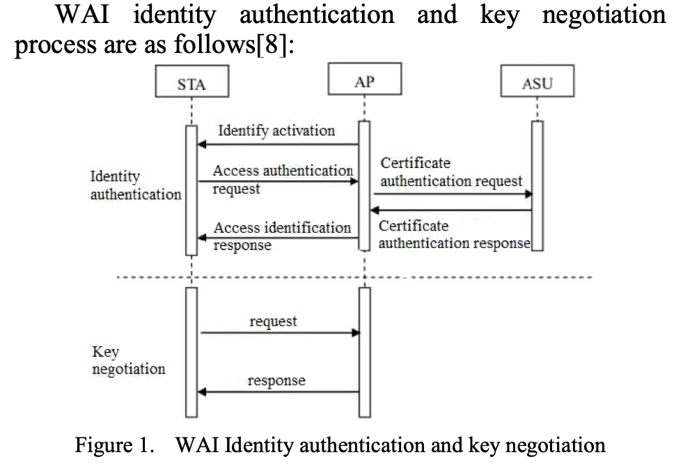
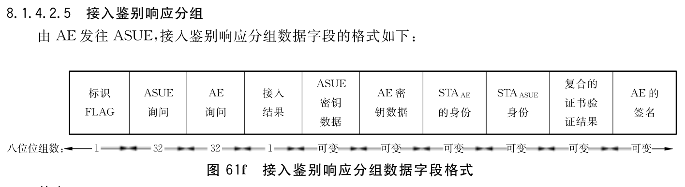

# 使用Proverif进行WAPI协议验证
PB21061361 韦睿鑫
## WAPI简介
WAPI（WLAN Authentication and Privacy Infrastructure，中文名为无线局域网鉴权和保密基础结构）是由中国最初于2003年制定的一种无线局域网安全协议，旨在提高无线通信的安全性。WAPI 协议主要用于无线局域网（WLAN），类似于广泛使用的 Wi-Fi 安全协议 WPA/WPA2，但其设计有一些独特的特点和机制。

WAPI分为两个部分，分别是WAI（WLAN Authentication Infrastructure）和WPI（WLAN Privacy Infrastructure）。WAI主要负责用户的身份验证，WPI在WAI验证通过的基础上，主要负责数据的加密和解密，随后传输数据。



本实验主要关注WAI的第一阶段，即证书鉴别过程。


WAPI协议的证书鉴别过程主要为：

- 鉴别激活。当 STA 关联或重新关联至 AP 时,由 AP 向 STA 发送鉴别激活以启动整个鉴别过程。
- 接入鉴别请求。STA 向 AP 发出接入鉴别请求，即将STA证书与STA 的当前系统时间发往AP,其中系统时间称为接入鉴别请求时间。
- 证书鉴别请求。AP 收到 STA 接入鉴别请求后，首先记录鉴别请求时间，然后向 ASU 发出证书鉴别请求，即将 STA 证书、接入鉴别请求时间、AP 证书及 AP 的私钥对它们的签名构成证书鉴别请求发送给 ASU。
- 证书鉴别响应。ASU 收到 AP 的证书签别请求后,验证 AP 的签名和 AP 证书的有效性，若不正确，则鉴别过程失败，否则进一步验证STA 证书。验证完毕后,ASU 将 STA 证书鉴别结果信息(包括 STA 证书和鉴别结果)、AP 证书鉴别结果信息(包括 AP 证书、鉴别结果及接人鉴别请求时间)和 ASU 对它们的签名构成证书鉴别响应发回给 AP。
- 接入鉴别响应。AP对 ASU 返回的证书鉴别响应进行签名验证，得到 STA 证书的鉴别结果，根据此结果对 STA 进行接入控制。AP将收到的证书签别响应回送至 STA。 STA 验证 ASU的签名后,得到 AP 证书的鉴別结果,根据该鉴别结果决定是否接入该 AP。至此STA 与 AP 之间完成了证书鉴别过程。若鉴别成功，则 AP 允许 STA 接入，否则解除其关联。

由于部分论文及文件中使用的术语不同，在这里指定：其中STA是指Station，即无线终端设备（ASUE），AP是指Access Point，即无线接入点（AE），ASU是指Authentication Server Unit，即鉴别服务器单元（ASE）。在国家标准《信息技术 系统间远程通信和信息交换局域网和城域网 特定要求第11部分：无线局域网媒体访问控制和物理层规范，第1号修改单》(GB 15629.11-2003-XG1-2006.)有详细的介绍。本实验根据其8.1.4章节中对WAI的描述进行验证。

在完成WAI的验证后，SAT与AP将会获得一个共享密钥（称为Base Key），用于后续的数据传输加密。


## WAPI协议验证
只考虑预鉴别（初次鉴别）过程。
### 鉴别激活过程

该过程中，我们关心的字段为鉴别标识，ASU身份，SAT_AE(AP)的证书，ECDH参数。其余参数与安全性无关。鉴别标识可记为sid，采用随机数算法生成的一个类似于进程号的随机数，并在整个鉴别过程中活跃。获取ASU的身份后，STA根据ASU身份选择由ASU颁发的证书或是本地策略选择证书，这里为方便默认ASU证书已存储在STA本地。AP的证书可以表示为$cert_{AP}$，其中包含AP的公钥和AP的身份信息。ECDH生成基数$g$，因此此次发送的数据可以描述为 $$ AP\rightarrow STA: sid, cert_{AP}，g$$

对应的Proverif语句中，需要定义一系列密钥，用于创建证书。根据8.1章节中的描述，证书需要包含持有者的公钥，颁发者的签名和签名算法，因此可以描述为：
```pv
type pkey. (* 公钥 *)
type skey. (* 私钥 *)
type spkey. 
type sskey. 
type nonce. (* 随机数 *)

(* 证书签名 *)
fun cpk(sskey): spkey.
fun sign2cert(id, pkey, sskey): certSign.   (* 证书签名 *)
fun certificat(id, pkey, certSign): cert [data]. 
reduc forall Pid:id, Pspk:pkey, ssk:sskey; checkcert(certificat(Pid, Pspk, sign2cert(Pid, Pspk, ssk)), cpk(ssk)) = pass.
```
其中sign2cert是颁发者的签名，随后使用持有者公钥，持有者身份以及颁发者签名组成证书。checkcert用于验证证书的有效性。

这一过程描述为
```pv
new sid: nonce;
new g: G;
let msg1 = Process1((sid, certAP, g)) in
out(c, msg1);
(* 发送到SAT的消息 *)
```
Process1是一个通信过程的定义，其类型是message.（自定义）
### 接入鉴别请求
STA接收到信息后，发送接入鉴别请求。
```pv
in(c, msg1:message);
let Process1((sid: nonce, certAP: cert)) = msg1 in
```


STA向AP发送接入鉴别请求。其中主要包含STA询问（challenge），STA的密钥，AP的身份，SAT的证书，SAT的签名。

STA的证书可以表示为$cert_{STA}$，SAT的密钥是临时的，采用椭圆曲线的Diffie-Hellman算法生成，为简化过程，此处即定义一个基数$g$，随机选取一个数$a$，计算$A=ga$（并非普通意义的乘法），然后将$A$发送到AP。改算法要求保持类似指数乘法的交换律即可。即有
```pv
(* -----Diffie-Hellman 密钥交换协议 ---- *)
type ex.
type G. (* 基数 *)
const g_: G [data].
fun exponent(G, ex): G.
equation forall a:ex, b:ex; exponent(exponent(g_, a), b) = exponent(exponent(g_, b), a).
```

SAT的询问可以表示为$challenge_{SAT}$。是一个随机数。

AP的身份表示为$ID_{AP}$，SAT的签名表示为$sign_{SAT}$，它是对本组数据除了签名本身之外的所有数据进行签名，故这一过程可以表示为
$$SAT\rightarrow AP: sid, ID_{AP}, challenge_{SAT}, g, A, cert_{SAT}, sign_{SAT}(sid, ID_{AP}, challenge_{SAT}, g, A) $$

签名的过程在proverif中可以表示为
```pv
(* 消息签名 *)
fun spk(skey): pkey.
fun sign2m(bitstring, skey): bitstring.
reduc forall m:bitstring, sk:skey; checksign(m, sign2m(m, sk), spk(sk)) = pass.
```
其中sign2m是对消息进行签名，checksign用于验证签名的有效性。

这一过程描述为
```pv
let Process1((sid: nonce, certAP: cert)) = msg1 in
let certificat(AP_id, AP_pk, certSignAP) = certAP in
(* 接收到AP的消息 *)
(* 生成Diffie-Hellman 密钥 *)
new challengeSAT: nonce;
new a: ex;
new g: G;
let A = exponent(g, a) in
let signSAT = sign2m((sid, AP_id, challengeSAT, certSAT, A, g), SAT_sk) in
out(c, Process2((sid, AP_id, challengeSAT, certSAT, signSAT, A, g)));
(* sid:鉴别标识，AP_id:AP的身份，challengeSAT:SAT随机数，certSAT:SAT的证书，signSAT:SAT的签名，g,A:密钥 *)
```
### 证书鉴别请求
AP接收到信息后，首先需要检查SAT的签名以及身份信息，签名验证通过后，才能向向ASU发送证书鉴别请求。
```pv
(* 接收SAT消息 *)
    in(c, msg2:message);
    let Process2((msid: nonce, mid: id, mchallenge: nonce, mcertSAT: cert, msignSAT: bitstring,  mA: G, mg: G)) = msg2 in
    let certificat(SAT_id, SAT_pk, certSAT) = mcertSAT in
    (* 接收到SAT的消息 *)
    if msid = sid && mid = AP_id && mg = g then(
        (* 检查SAT的签名 *)
        if checksign((msid, mid, mchallenge, mcertSAT, mA, mg), msignSAT, SAT_pk) = pass then (* !!!!! review !!!! *)
        (* 签名验证通过 *)
```
发送的证书鉴别请求包括

其中，ADDID是SAT和AU的mac地址合并，即$ADDID = mac_{SAT} || mac_{AP}$. AP询问是新生成的随机数，SAT询问是AP接收到的SAT询问，以及AP和SAT的证书。因此本阶段的消息发送可以表示为
$$AP\rightarrow ASU: sid, ADDID, challenge_{AP}, challenge_{SAT}, cert_{AP}, cert_{SAT}$$
```pv
new challengeAP: nonce;
let msg3 = Process3((ADDID(macAP, macSAT), challengeAP, mchallenge, certAP, certSAT)) in
out(c, msg3);
```
其中ADDID可以定义为
```pv
(* ADDID *)
fun ADDID(macAddress, macAddress): addid [data].
```
### 证书鉴别响应
ASU接收到信息后，首先需要检查AP的证书、SAT的证书，验证成功后根据成功验证的结果，构造相应的信息，附上ASU的签名后发回AP，构成证书鉴别响应。响应中包含：


其中证书的验证结果分别用 $check_{AP}, check_{SAT}$表示. SAT和AP信任的服务器视为同一个，此时签名只存在一个。“证书的验证结果”包含了之前的询问、证书，为方便处理分开。因此本阶段的消息发送可以表示为
$$ ASU\rightarrow AP: sid, ADDID, cert_{AP}, cert_{SAT}, check_{AP}, check_{SAT}, challenge_{SAT}, challenge_{AP}, sign_{ASU}(...)$$

用proverif表示为
```pv
in(c, msg3:message);
let Process3((ADDID(macAP:macAddress, macSAT: macAddress), challengeAP: nonce, challengeSAT: nonce, certAP: cert, certSAT: cert)) = msg3 in
(* 接收到AP的消息 *)
(* 验证证书 *)
if checkcert(certAP, cpk(AS_ssk)) = pass then
(* 证书验证通过 *)
let checkAP = 1 in
if checkcert(certSAT, cpk(AS_ssk)) = pass then
(* 证书验证通过 *)
let checkSAT = 1 in
if checkAP = 1 && checkSAT = 1 then(
    let signAS = sign2m((ADDID(macAP, macSAT), challengeAP, challengeSAT, checkAP, checkSAT, certAP, certSAT), AS_sk) in
    let msg4 = Process4((ADDID(macAP, macSAT), challengeAP, challengeSAT, checkAP, checkSAT, certAP, certSAT, signAS)) in
    out(c, msg4)
    (* 发送msg4 到AP *)
)
```
### 接入鉴别响应
当AP接收到来自ASU的信息后，首先需要检查ASU的签名，验证成功后，根据验证结果，生成对应的Diffie-Hellman密钥，并根据STA发来的对应的Diffie-Hellman密钥，生成共享密钥。具体做法是，生成随机数$b$，计算$Ab = gab$，对其进行拓展
$$ KD-HashMac(Ab, challenge_{AP} || challenge{SAT})$$
生成基密钥BK，记为$BK_{AP}$并保存。然后根据
$$ KD-HashMac-SHA256(Ab, challenge_{AP} || challenge{SAT})$$
生成下一次鉴别的标识$next_{AP}$并保存。

随后再根据ASU的信息构造接入鉴别响应，发送给SAT。消息包含：

其中SAT询问、AP询问为之前的询问，接入结果为：验证结果全部通过，则接入结果为0，否则为其他值，记为$response$。SAT密钥数据为之前生成的Diffie-Hellman密钥$A$，AP密钥数据为$B = gb$。SAT和AP身份同前（SAT身份可以由之前发来的SAT证书得到），符合的证书验证结果即两个证书各自的验证结果，以及加上之前AP发送给ASU的整个消息（可选），最后对这组消息进行签名。

因此该消息可以表示为
$$AP\rightarrow SAT:ID_{AP}, ID_{SAT}, challenge_{AP}, challenge_{SAT}, B, A, response, (AP\rightarrow ASU), sign_{AP}()$$
```pv
(* 接收到AS的消息 *)
let certificat(AS_id, AS_pk, certSignAS) = certAS in
if checksign((ADDID(ASmacAP, ASmacSAT), ASchallengeAP, ASchallengeSAT, AScheckAP, AScheckSAT, AScertAP, AScertSAT), ASsignAS, AS_pk) = pass then
(* 签名验证通过 *)
if AScheckAP = 1 && AScheckSAT = 1 then(
    new b: ex;
    let response = 1 in
    let B = exponent(g, b) in
    let AP_bk = HashMac_BK(exponent(mA, b), challengeAP, mchallenge) in
    let AP_nextid = SHA256(HashMac_nonce(exponent(mA, b), challengeAP, mchallenge)) in
    event AP_bk_generate(AP_id, AP_bk);
    event AP_nextid_generate(AP_id, AP_nextid);
    let signAP = sign2m((AP_id, SAT_id, challengeAP, mchallenge, B, mA, response, msg4), AP_sk) in
    let msg5 = Process5((AP_id, SAT_id, challengeAP, mchallenge, B, mA, response, msg4, signAP)) in
    out(c, msg5)
    (* 发送msg5 到SAT *)
)
```
### SAT生成基密钥
SAT接收到信息后，首先需要检查AP的签名，验证成功后，再检查ASU鉴别的响应是否得到肯定的回复。若鉴别通过，则再检查ASU的签名是否通过，以上检查全部通过后，SAT允许AP接入。此时SAT在本地根据Diffie-Hellman密钥生成基密钥$BK_{SAT}$，并保存。同时根据Diffie-Hellman密钥生成下一次鉴别的标识$next_{SAT}$并保存。
$$ BK_{SAT} = KD-HashMac(Ba, challenge_{AP} || challenge_{SAT})$$
$$ next_{SAT} = KD-HashMac-SHA256(Ba, challenge_{AP} || challenge_{SAT})$$

可以证明 $BK_{SAT} = BK_{AP} $，因为 $Ba = gba = gab = Ab$，因此两者生成的基密钥相同。同时二者生成的下一次鉴别标识也相同。

## Proverif验证
### 验证对象
由于后续的通信基于生成的基密钥进行，因此WAPI应断言SAT与AP生成的基密钥和下一次鉴别标识是attacker不能知晓的。除此之外下一次通信的鉴别标识也不能被attacker知晓。因此需要验证
```pv
query secret SAT_bk.
query secret SAT_nextid.
query secret AP_bk.
query secret AP_nextid.
```
除此之外，还需要验证基密钥一一对应，即每一个SAT的基密钥对应唯一一个AP的基密钥。这一验证可以使用inj-event定义，因此定义事件和验证
```pv
event AP_bk_generate(id, bkey).
event SAT_bk_generate(id, bkey).
query SAT_id:id, AP_id:id, bk: bkey; inj-event(SAT_bk_generate(SAT_id, bk)) ==> inj-event(AP_bk_generate(SAT_id, bk)).
```
类似地，需要验证下一次鉴别标识的一一对应，以及sid的一一对应关系。
```pv
query SAT_id:id, AP_id:id, nextid: nonce; inj-event(SAT_nextid_generate(SAT_id, nextid)) ==> inj-event(AP_nextid_generate(SAT_id, nextid)).
query SAT_id:id, AP_id:id, sid:nonce; inj-event(SAT_sid(SAT_id, sid)) ==> inj-event(AP_sid_sent(AP_id, sid)).
```
随后定义process
```pv
process
    new SAT_id: id;
    new AP_id: id;
    new AS_id: id;
    new SAT_sk: skey;
    new AP_sk: skey;
    new AS_sk: skey;
    new AS_ssk: sskey;
    new macSAT: macAddress;
    new macAP: macAddress;
    let SAT_pk = spk(SAT_sk) in
    out (c, SAT_pk);
    let AP_pk = spk(AP_sk) in
    out (c, AP_pk);
    let AS_pk = spk(AS_sk) in
    out (c, AS_pk);
    
    let certSAT = certificat(SAT_id, SAT_pk, sign2cert(SAT_id, SAT_pk, AS_ssk)) in
    let certAP = certificat(AP_id, AP_pk, sign2cert(AP_id, AP_pk, AS_ssk)) in
    let certAS = certificat(AS_id, AS_pk, sign2cert(AS_id, AS_pk, AS_ssk)) in
    (SAT_Auth(SAT_id, SAT_sk, certSAT, certAS, macSAT) | AP_Auth(AP_id, AP_sk, certAP, certAS, macAP, macSAT) | AS_Auth(AS_id, AS_sk, AS_ssk, certAS))
```
定义一系列用于签名和认证的私钥，生成对应的公钥。假定这些公钥是可以公开访问的。随后生成对应的证书，以及mac地址加载到系统中。最后调用对应的验证过程。

输入命令
```shell
proverif2.05/proverif exp2/au2.pv > au.log
```
可以得到结果为
```log
--------------------------------------------------------------
Verification summary:

Query secret SAT_bk is true.

Query secret SAT_bkid is true.

Query secret AP_bk is false.

Query secret AP_bkid is false.

Query inj-event(SAT_bk_generate(SAT_id_3,bk)) ==> inj-event(AP_bk_generate(SAT_id_3,bk)) is true.

Query inj-event(SAT_bkid_generate(SAT_id_3,bkid)) ==> inj-event(AP_bkid_generate(SAT_id_3,bkid)) is true.

Query inj-event(SAT_sid(SAT_id_3,sid_3)) ==> inj-event(AP_sid_sent(AP_id_3,sid_3)) is false.

--------------------------------------------------------------
```
可以看到，SAT的基密钥和下一次鉴别标识是安全的，但AP的基密钥和下一次鉴别标识是不安全的。同时，SAT和AP的基密钥和下一次鉴别标识是一一对应的，但sid的一一对应关系不成立。

### 修改协议
回看过程，可以发现，对于基密钥$BK_AP$出现的攻击漏洞为：
- 假设attacker知道SAT发去的SAT询问$challenge_{SAT}$，并且知道证书所需的持有者公钥，知道SAT的身份。
- attacker可以伪造SAT的证书
- attacker通过Process1(AP->AST)获取了ECDH的基数g，获取AP的身份 $ID_{AP}$，鉴别标识$sid$.
- attacker可以通过消息重放攻击，制造一份与SAT相同的消息，发送给AP。随后AP认为其在与attacker通信，从而attacker能够获取AP相同的基密钥。

这与[1]中所描绘的问题一致，即attacker有可能通过消息重放攻击获取到AP的基密钥。实验中发现，可以让ECDH参数由STA生成，而不是AP生成，这样可以避免这一问题。[1]中给出的方案是不直接发送EDCH参数，而是基于EDCH直接生成公钥。这样可以避免attacker获取到基密钥。

修改代码，对于AP发送的消息
```pv
let Process1((sid: nonce, certAP: cert)) = msg1 in
    let certificat(AP_id, AP_pk, certSignAP) = certAP in
    (* 接收到AP的消息 *)
```
对于SAT发送给AP的消息
```pv
new challengeSAT: nonce;
new a: ex;
new g: G;
let A = exponent(g, a) in
let signSAT = sign2m((sid, AP_id, challengeSAT, certSAT, A, g), SAT_sk) in
out(c, Process2((sid, AP_id, challengeSAT, certSAT, signSAT, A, g)));
```
仅仅通过这个微小的改动，可以使得AP的基密钥安全。重新验证后，可以得到
```log
--------------------------------------------------------------
Verification summary:

Query secret SAT_bk is true.

Query secret SAT_nextid is true.

Query secret AP_bk is true.

Query secret AP_nextid is true.

Query inj-event(SAT_bk_generate(SAT_id_3,bk)) ==> inj-event(AP_bk_generate(SAT_id_3,bk)) is true.

Query inj-event(SAT_nextid_generate(SAT_id_3,nextid)) ==> inj-event(AP_nextid_generate(SAT_id_3,nextid)) is true.

Query inj-event(SAT_sid(SAT_id_3,sid_3)) ==> inj-event(AP_sid_sent(AP_id_3,sid_3)) is false.

--------------------------------------------------------------
```
可以发现AP的基密钥和下一次鉴别标识是安全的，同时SAT和AP的基密钥和下一次鉴别标识是一一对应的。但sid的一一对应关系不成立，回看日志发现attacker可能会知道AP的身份、证书持有公钥和签名从而伪造证书，进一步伪造出AP发送给SAT的消息，导致sid的一一对应关系不成立。这一问题可能需要其他方式解决，由于时间关系，此处实验没有进一步探究。


## 总结
本次实验使用Proverif对WAPI协议的证书鉴别过程进行了验证。通过对协议的分析，可以发现协议中存在一些安全问题，通过Proverif验证可以发现这些问题。通过对协议的修改，可以使得协议更加安全。

通过本实验，认识到Proverif是一个强大的验证工具。但是Proverif的验证过程需要对协议有一定的了解，需要对协议的细节有一定的把握，并且设计过程非常费事费力，还需要对Proverif语法了解，参考了Proverif 2.05的手册。由于是第一次接触Proverif，在过程中查阅了一些资料，代码撰写过程可能也不规范，可能存在一些错漏，花费了许多时间。

该协议诞生于此已经20年有余，彼时可能还没有认识到如此强大的验证工具，因此在设计中可能存在一些问题。通过Proverif的验证，可以发现这些问题，进一步完善协议的设计。因此在现在实际的协议设计中，可以通过Proverif对协议进行验证，发现其中的安全问题，进一步完善协议的设计。

### 文件说明
`au.pv`是原版WAPI协议，`au2.pv`是稍加修改后的WAPI协议。`au0630.log`是原版WAPI协议的验证结果，`au0630_2.log`是修改后的WAPI协议的验证结果。
 

## 参考资料
https://ieeexplore.ieee.org/stamp/stamp.jsp?tp=&arnumber=9939349
https://support.huawei.com/enterprise/en/doc/EDOC1100276721/3508a63d/wapi
https://citeseerx.ist.psu.edu/document?repid=rep1&type=pdf&doi=e6b90a20f79d36395672913033e32c899780bc20
https://eprint.iacr.org/2007/344.pdf
https://bblanche.gitlabpages.inria.fr/proverif/manual.pdf
https://openstd.samr.gov.cn/bzgk/gb/newGbInfo?hcno=74B9DD11287E72408C19C4D3A360D1BD
https://www.h3c.com/cn/d_200805/605893_30003_0.htm#_Toc198368505
https://www.doc88.com/p-9438630518419.html


<!--https://link.springer.com/article/10.1007/s10703-024-00448-z-->